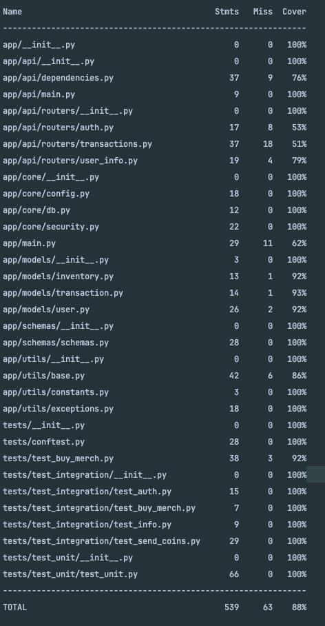
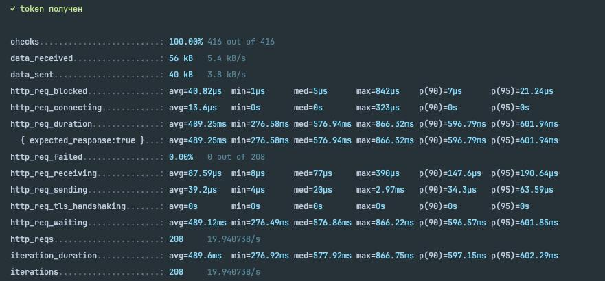
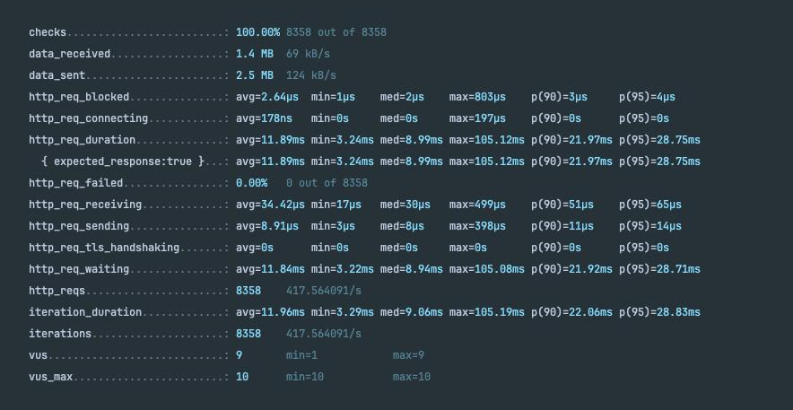
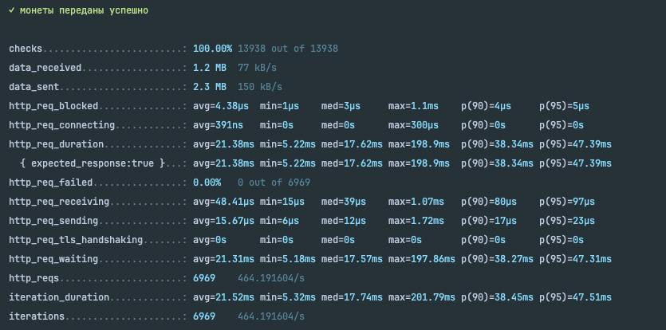
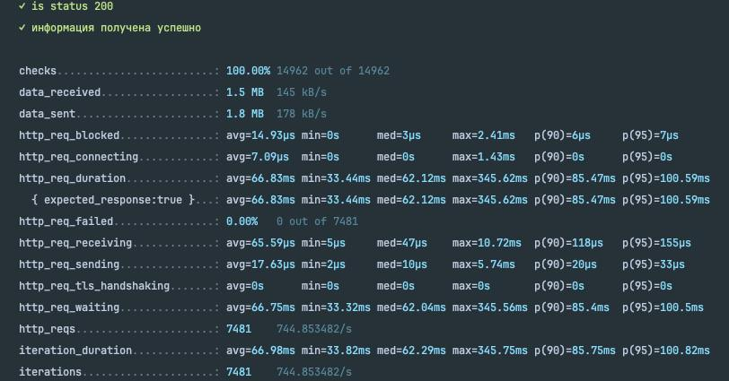

# MerchCoin

The `MerchCoin` service provides an API for employees to manage and spend their coins in the company merch store.
Employees can view their purchased items, track their coin transfers, and buy merch using coins.

# How to Start the Service

## Docker (Recommended, all configurations are set up)

### Clone the Repository

First, clone the repository to your local machine:

```bash
git clone https://github.com/Helkok/merch-coin
cd merch-coin
```

```bash
docker-compose up
```

By default, service is available at http://localhost:8080.

### Ports

•    **8080**: The service API

•    **5432**: The default PostgreSQL database port.

If you need to change the port, you can modify the docker-compose.yml file:

```yaml
services:
  db:
    image: postgres
    ports:
      - "5432:5432"  # Change the host-side port if needed
```

# Documentation

The service documentation is available at /docs after starting the service. By default, it’s accessible
at http://localhost:8080/docs. This includes a detailed description of the available endpoints and models.

## Authentication

***`POST /api/auth`***

Authenticate and receive a JWT token.

### Request:

```http 
POST /api/auth HTTP/1.1
Host: localhost:8080
Content-Type: application/json

{
  "username": "your_username",
  "password": "your_password"
}
```

### Response:

***200 OK*** - Successful authentication, returns the token.

```http 
HTTP/1.1 200 OK
Content-Type: application/json
Connection: close

{"token":"your_token"}
```

***400 Bad Request*** - Invalid request format.

***401 Unauthorized*** - Incorrect username or password.

***500 Internal Server*** Error - Server error.

## Transactions

***`GET /api/buy/{item}`***

Buy an item using coins.

### Merch items available in the shop:

| Name       | Price |
|:-----------|:------|
| t-shirt    | 80    |
| cup        | 20    |
| book       | 50    |
| pen        | 10    |
| powerbank  | 200   |
| hoody      | 300   |
| umbrella   | 200   |
| socks      | 10    |
| wallet     | 50    |
| pink-hoody | 500   |

### Request:

```http
GET /api/buy/<YOUR_MERCH> HTTP/1.1
Host: localhost:8080
Authorization: Bearer <your_jwt_token>
```

### Response:

200 OK - Item successfully bought.

```http 
HTTP/1.1 200 OK
Content-Type: application/json
Connection: close

{"detail": "Успешный ответ."}
```

400 Bad Request - Invalid request.

401 Unauthorized - Missing or invalid token.

500 Internal Server Error - Server error.

## Send Coins to User

***`POST /api/sendCoin`***

Send coins to another user.

### Request:

```http
POST /api/sendCoin HTTP/1.1
Host: localhost:8080
Authorization: Bearer <your_jwt_token>
Content-Type: application/json

{
  "toUser": "recipient_username",
  "amount": 100
}
```

### Response:

200 OK - Coins sent successfully.

```http 
HTTP/1.1 200 OK
Content-Type: application/json
Connection: close

{"detail": "Успешный ответ."}
```

400 Bad Request - Invalid request (e.g., not enough coins or invalid recipient).

401 Unauthorized - Missing or invalid token.

500 Internal Server Error - Server error.

**Note:** Coins cannot go below zero. If a transaction would result in a negative balance, it will be rejected.

## User Info

***`GET /api/info`***

Retrieve information about the user’s coins, inventory, and transaction history.

### Request:

```http
GET /api/info HTTP/1.1
Host: localhost:8080
Authorization: Bearer <your_jwt_token>
```

### Response:

200 OK - User’s information.

```http 
HTTP/1.1 200 OK
Content-Type: application/json
Connection: close

{
  "coins": 500,
  "inventory": [
    {
      "type": "t-shirt",
      "quantity": 2
    },
    {
      "type": "book",
      "quantity": 1
    }
  ],
  "coinHistory": {
    "received": [
      {
        "fromUser": "sender_username",
        "amount": 100
      }
    ],
    "sent": [
      {
        "toUser": "recipient_username",
        "amount": 50
      }
    ]
  }
}
```

400 Bad Request - Invalid request.

401 Unauthorized - Missing or invalid token.

500 Internal Server Error - Server error.

## Important Rules

•    **Security:** The API requires a Bearer Token for any protected endpoints. You must authenticate via the /api/auth
endpoint to receive the JWT token.

•    **Merchandise:** There are 10 types of merchandise available for purchase. Each item has a specific price in coins.
The list of items and their prices is shown above.

•    **Coin Balance:** Employees can send and receive coins, but their balance cannot go below zero. Any transaction
that would result in a negative balance will be rejected.

•    **Transaction History:** Users can view their transaction history, which shows both received and sent coins.

# Additional Information

## Test Coverage



• ```Test coverage is 88%.```

## Load Testing

Load testing was conducted using [k6](https://k6.io), a modern open-source tool for testing the performance of APIs and
services. Below are the results of the load testing, showing how the service performs under various loads.

### Auth:



*avg* **RPS**: 20/s - *my pc and python feature.*

*avg* **SLI** response time - 400ms - many processor-dependent operations that are executed synchronously in python

### Buy:



*avg* **RPS**: 420/s - *my pc.*

*avg* **SLI** response time - 11ms

### SendCoins:



*avg* **RPS**: 750/s - *python feature.*

*avg* **SLI** response time - 60ms

### Info:



*avg* **RPS**: 470/s - *my pc and python feature.*

*avg* **SLI** response time - 20ms

## Linter description

A description of the linter configuration is located in the [.ruff.toml](./.ruff.toml) file


